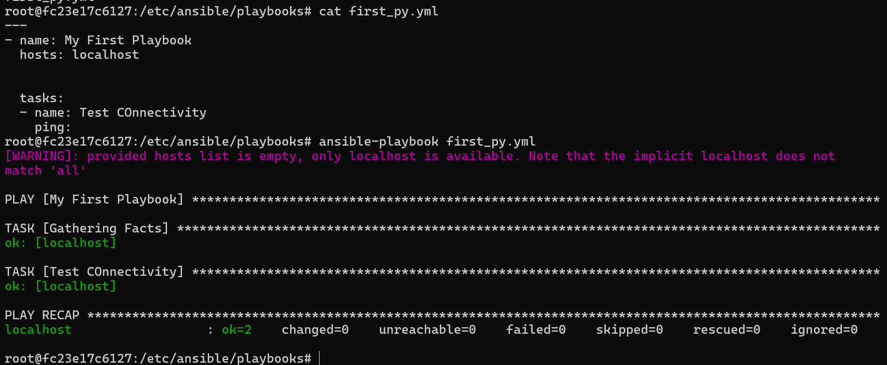

### create playbooks dir inside /etc/ansible [Use can create this anywhere]

```bash
mkdir playbooks
```

### Run ansible notebook
```bash
ansible-playbook first_py.yml
```




### Syntax check
```bash
ansible-playbook --syntax-check first_py.yml
```

yaml code

```yml
---
- name: My First Playbook
  hosts: localhost


  tasks:
  - name: Test COnnectivity
    ping:
  - name: "Print My message"
    debug: msg="This is shruti"

```


```bash
ansible-inventory --list -y
```


```bash
ansible-inventory --list -y
```